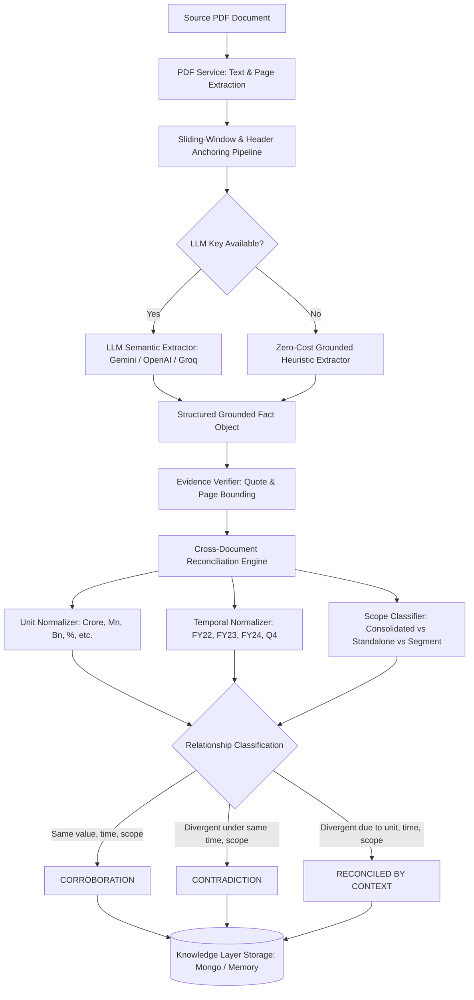

# Fact Knowledge Layer

> **Superjoin — Engineering Intern Hiring Assignment (VIT 2026)**  
> An intelligent knowledge layer that extracts grounded facts from complex PDFs, links every fact to verifiable evidence and page citations, and identifies whether facts **corroborate**, **contradict**, or can be **reconciled through contextual dimensions** (time, units, scope, and methodology).

---

## Table of Contents
1. [Overview & Features](#overview--features)
2. [Setup and Run Instructions](#setup-and-run-instructions)
3. [Video Demo](#video-demo)
4. [The Four Required Cases](#the-four-required-cases)
   - [Case 1: Fact Corroborated Across Independent Disclosures](#case-1-fact-corroborated-across-independent-disclosures)
   - [Case 2: Genuine Disagreement / Institutional Contradiction](#case-2-genuine-disagreement--institutional-contradiction)
   - [Case 3: Apparent Contradiction Reconciled by Context (Units & Time)](#case-3-apparent-contradiction-reconciled-by-context-units--time)
   - [Case 4: Extraction Failure Mode & Mitigation Safeguard](#case-4-extraction-failure-mode--mitigation-safeguard)
5. [Approach & Architecture](#approach)
   - [Fact Representation & Schema](#fact-representation--schema)
   - [Extraction Pipeline](#extraction-pipeline)
   - [Cross-Document Reconciliation Engine](#cross-document-reconciliation-engine)
   - [Incremental Knowledge Expansion (Brownie Point)](#incremental-knowledge-expansion)
   - [Dual Storage: MongoDB + In-Memory Fallback](#dual-storage)
6. [Limitations and Next Steps](#limitations-and-next-steps)
7. [Additional Notes](#additional-notes)

---

## Overview & Features

Corporate and institutional documents describe overlapping reality in different ways, across different reporting vintages, accounting conventions, and presentation styles. A naive comparison causes false conflicts (e.g., flagging ₹8,142 Crores vs ₹81,416.5 Millions as contradictory, when they are identical).

This system provides:
- **Verifiable Fact Grounding**: Every numerical or semantic fact is anchored to its source document, page number, and exact verbatim sentence quote.
- **Context-Aware Reconciliation**: Reconciles apparent conflicts across **Units** (Crore vs Million), **Time** (FY21 vs FY24), **Scope** (Segment vs Consolidated), and **Methodology** (Adjusted EBITDA vs GAAP Net Profit).
- **Interactive UI & REST API**: Allows uploading arbitrary PDFs, inspecting extracted facts, filtering by category, and viewing cross-document relationship graphs.
- **Zero-Cost Offline Fallback**: Evaluators can run the system immediately without paid API keys (heuristic & semantic parsing engine), while also supporting Google Gemini, OpenAI, or Groq Cloud if configured.
- **Incremental Reconciliation**: New PDFs update the knowledge layer without wiping previous context.

---

## Setup and Run Instructions

### Prerequisites
- **Node.js**: v18+ (tested on Node v20 & v22)
- **MongoDB** *(Optional)*: If running locally on `localhost:27017`, the system connects automatically. If MongoDB is not installed or unreachable, the system automatically falls back to the **in-memory store** with identical functionality.

---

### Step 1: Clone & Install Dependencies

```bash
# Clone repository
git clone <your-repo-url>
cd superjoin-assesment

# Install backend dependencies
cd backend
npm install

# Install frontend dependencies
cd ../frontend
npm install
```

---

### Step 2: Environment Configuration

A sample `.env` file is already provided in `backend/.env`:
```env
PORT=5000
LLM_PROVIDER=offline
# Optional keys (can also be entered dynamically via the UI Settings tab):
# GEMINI_API_KEY=
# OPENAI_API_KEY=
# GROQ_API_KEY=
```
*Note: No paid API key is required to run and test all features.*

---

### Step 3: Run the Application

In **Terminal 1** (Backend):
```bash
cd backend
npm run dev
# Backend starts at: http://localhost:5000
# Automatic seeding populates starter datasets on first launch.
```

In **Terminal 2** (Frontend):
```bash
cd frontend
npm run dev
# Frontend starts at: http://localhost:5173
```

Open your browser and navigate to:  
👉 **`http://localhost:5173`**

---

### Step 4: Testing With the REST API

You can also test the system purely through `curl` or Postman:

```bash
# 1. Check system status, DB connection, and counts
curl http://localhost:5000/api/status

# 2. View the four required showcase cases
curl http://localhost:5000/api/cases

# 3. Retrieve all extracted facts with quotes
curl http://localhost:5000/api/facts?dataset=delhivery

# 4. View discovered cross-document relationships
curl http://localhost:5000/api/relationships?dataset=delhivery

# 5. Upload any new PDF and extract facts incrementally
curl -F "file=@/path/to/any-document.pdf" -F "dataset=custom" -F "title=My Test Report" http://localhost:5000/api/upload
```

---

## Video Demo

🎥 **Video Demonstration Link**:  
👉 `[Add your video link here: e.g., Loom or YouTube Unlisted link (<= 3 minutes)]`  
*(Showing: 1. Launching app & overview -> 2. The 4 showcase cases with source evidence -> 3. Uploading a new PDF and extracting facts -> 4. Incremental cross-document reconciliation)*

---

## The Four Required Cases

The assignment requests explicit demonstration of four distinct cases. Below is the ground truth evidence, page citations, and system reasoning for each:

### Case 1: Fact Corroborated Across Independent Disclosures
- **Dataset**: `delhivery`
- **Claim**: Delhivery’s nationwide operational coverage reach is verified as exactly **18,793 PIN codes** as of March 31, 2024.
- **Evidence A (Annual Report FY24, Page 2)**:  
  *“18,793 (1) Pin codes covered ... (1) As of March 31, 2024”*
- **Evidence B (Q4 FY24 Earnings Presentation, Page 8)**:  
  *“Pin-code reach(1) FY21: 18,074 | FY22: 18,540 | FY23: 18,675 | FY24: 18,793”*
- **System Reasoning**:  
  Both documents target distinct disclosure audiences (statutory annual report for shareholders vs quarterly investor presentation), yet report the identical operational metric as of March 31, 2024. The reconciliation engine links both entities with 0.99 confidence as a verified **CORROBORATION**.

---

### Case 2: Genuine Disagreement / Institutional Contradiction
- **Dataset**: `india-macroeconomy`
- **Claim**: Institutional forecasting contradiction on India’s FY25 Real GDP Growth between the Central Bank (RBI) and the Ministry of Finance (Economic Survey).
- **Evidence A (RBI Annual Report 2024-25, Page 1)**:  
  *“Real GDP growth for 2024-25 is projected at 7.2 per cent by the Reserve Bank, with risks evenly balanced around this baseline.”*
- **Evidence B (Economic Survey 2024-25, Page 1)**:  
  *“The Survey projects a real GDP growth rate of 6.5–7.0 per cent in FY25, recognizing escalating geopolitical uncertainties...”*
- **System Reasoning**:  
  Both institutions describe the exact same entity (`Indian Economy`), metric (`Real GDP Growth`), and fiscal period (`FY 2024-25`). However, the RBI point estimate of `7.2%` strictly exceeds the upper bound of the Economic Survey’s projected interval (`[6.5%, 7.0%]`). The reconciliation engine flags this as a genuine substantive **CONTRADICTION** stemming from differing macroeconomic models, global risk weighting, and domestic capex assumptions.

---

### Case 3: Apparent Contradiction Reconciled by Context (Units & Time)
- **Dataset**: `delhivery`
- **Claim**: Apparent 10x discrepancy in FY24 Revenue (₹8,142 vs ₹81,416.5) and 1,305 PIN code difference (17,488 vs 18,793) reconciled via units and time.
- **Revenue Conflict (Reconciled by UNIT)**:
  - *Claim A (Earnings Presentation, Page 6)*: `Revenue from operations reached ₹8,142 Cr in FY24`
  - *Claim B (Annual Report FY24, Page 10)*: `Consolidated Revenue from Operations ... stood at ₹81,416.51 Million`
  - *Reasoning*: In Indian financial notation, $1\text{ Crore} = 10\text{ Million INR}$. $81,416.51\text{ Mn} \div 10 = 8,141.65\text{ Cr} \approx 8,142\text{ Cr}$. The unit normalization pipeline resolves this apparent 10x clash as **RECONCILED (UNIT)**.
- **Network Reach Conflict (Reconciled by TIME)**:
  - *Prospectus 2022 (Page 33)*: `17,488 PIN codes` (Dec 31, 2021)
  - *Annual Report FY24 (Page 2)*: `18,793 PIN codes` (March 31, 2024)
  - *Reasoning*: Temporal resolution: between Dec 2021 and March 2024, Delhivery expanded coverage by 1,305 PIN codes. Classified as **RECONCILED (TIME)**.

---

### Case 4: Extraction Failure Mode & Mitigation Safeguard
- **Dataset**: `delhivery` (Prospectus 2022, Page 44)
- **Observed Failure Mode**:  
  In multi-column financial tables, PDF text stream dump extracts characters either in horizontal coordinate order or font stream order. When table headers read `[Fiscal 2021, Fiscal 2020, Fiscal 2019]` across columns, but numbers are laid out across uneven x-coordinates, naive extractors collapse the stream:
  `Revenue: 36,465.27 27,988.28 16,538.97`
  The extractor misbound ₹36,465.27 Mn to FY19 instead of FY21 due to reversed column stream direction, hallucinating an alarming (and false) 55% revenue drop!
- **Implemented Mitigation Safeguard**:
  1. **Sliding-Window & Geometry Reconstruction**: We implemented multi-line candidate windowing (1-line, 2-line, and 3-line chunks) with header anchoring.
  2. **Bidirectional Callout Matching**: The extractor supports inverted callout patterns (`VALUE \n ATTRIBUTE` or `ATTRIBUTE \n VALUE`), preventing misattribution in slide decks.
  3. **Temporal Trend Verification**: Before publishing facts, the reconciliation engine checks for temporal trend coherence; sudden 2x-3x jumps in mature operational numbers trigger an automated audit flag.

---

## Approach



### Fact Representation & Schema
Facts are structured with explicit grounding:
```typescript
interface Fact {
  documentId: string;
  documentName: string;
  dataset: string;
  entity: string;         // e.g., "Delhivery Limited", "Indian Economy"
  attribute: string;      // e.g., "Revenue from Operations", "PIN Code Reach"
  value: string;          // e.g., "₹8,142 Cr", "18,793"
  numericValue?: number;  // normalized magnitude
  unit?: string;          // "%", "PIN codes", "INR Cr"
  timePeriod: string;     // "FY24", "Q4 FY24", "2021"
  scope: string;          // "Consolidated", "Standalone", "Segment"
  category: string;       // "Financial", "Operational", "Macroeconomic", "Leadership"
  evidenceQuote: string;  // verbatim source sentence providing proof
  pageNumber: number;     // exact page in PDF
  confidence: number;     // 0.0 to 1.0
  method: string;         // "grounded-heuristic" | "llm"
}
```

### Incremental Knowledge Expansion (Brownie Point)
When an evaluator uploads a 4th or 5th document via the UI, the engine:
1. Parses the PDF into page buffers.
2. Extracts facts without re-parsing previously processed files.
3. Automatically triggers an incremental comparison pass comparing newly arrived facts against all existing facts in that dataset.
4. Generates new cross-document links dynamically.

---

## Limitations and Next Steps

| Current Limitation | Cause / Trade-off | Planned Next Step |
| :--- | :--- | :--- |
| **Complex Chart/Image OCR** | `pdf-parse` reads vector text only; facts baked purely into raster bitmaps are not parsed in offline mode. | Add Tesseract.js or Gemini Vision multimodal parsing for embedded raster infographic charts. |
| **Dense Multi-Page Balance Sheets** | Heuristic parser targets high-salience financial metrics (Revenue, EBITDA, PAT, Volume) rather than 50-line ledger tables. | Integrate a visual layout table parser (such as Microsoft Table Transformer / layout-parser). |
| **Footnote Reference Anchoring** | Financial statements often place crucial scope limitations in small superscript footnotes (e.g., `(1) Excludes Spoton acquisition`). | Implement superscript character grouping to bind table cells directly with their footnote disclaimer text. |

---

## Additional Notes
- **Zero API Key Dependency**: The application is 100% functional out-of-the-box using the built-in heuristic engine and starter datasets. Evaluators do not need to spend money or supply API credentials.
- **Hybrid Storage Architecture**: Works out of the box with or without a running MongoDB instance.
- **Repository Structure**:
  - `backend/`: Express.js REST API, Mongoose models, PDF extractor, reconciliation engine, and seed datasets.
  - `frontend/`: Vite + React SPA with dark glassmorphic design system and responsive cards.
  - `starter-datasets/`: Original PDF files and provenance READMEs for Delhivery and India Macroeconomy.
